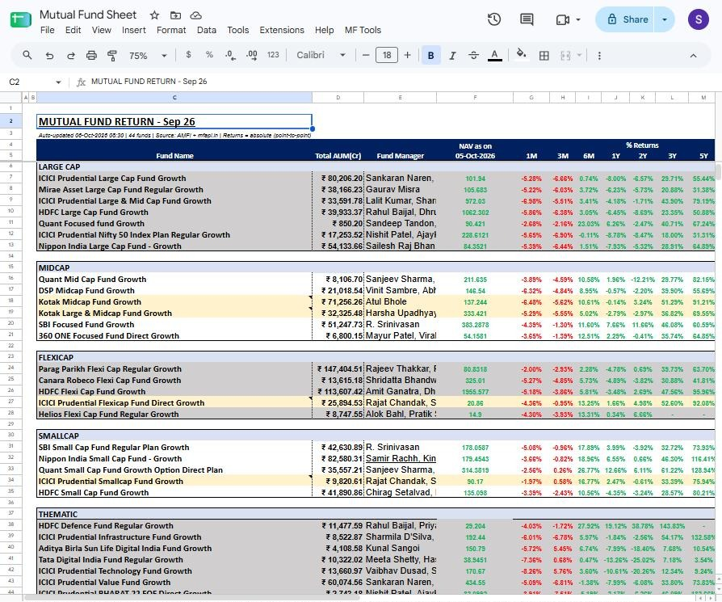
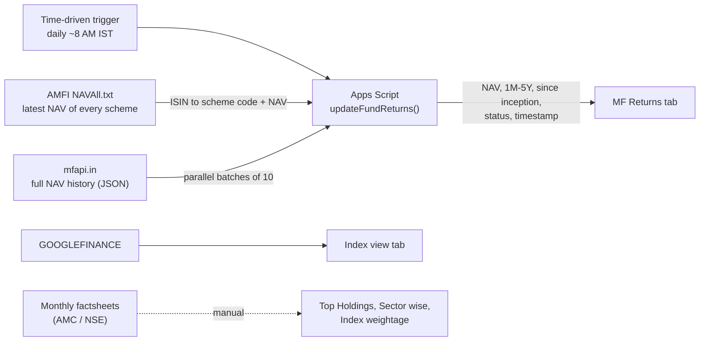
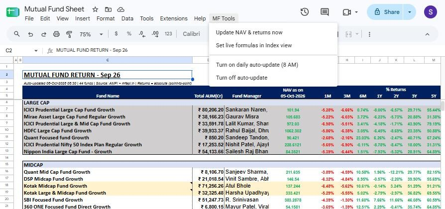
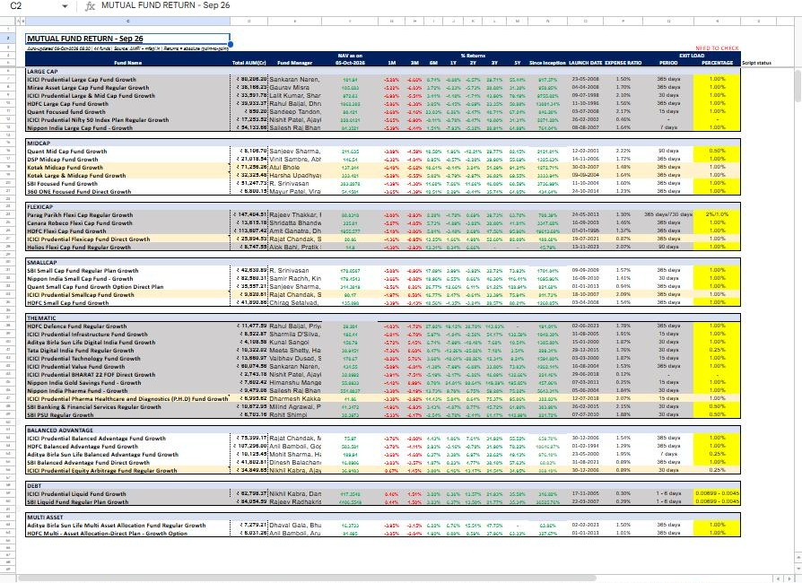
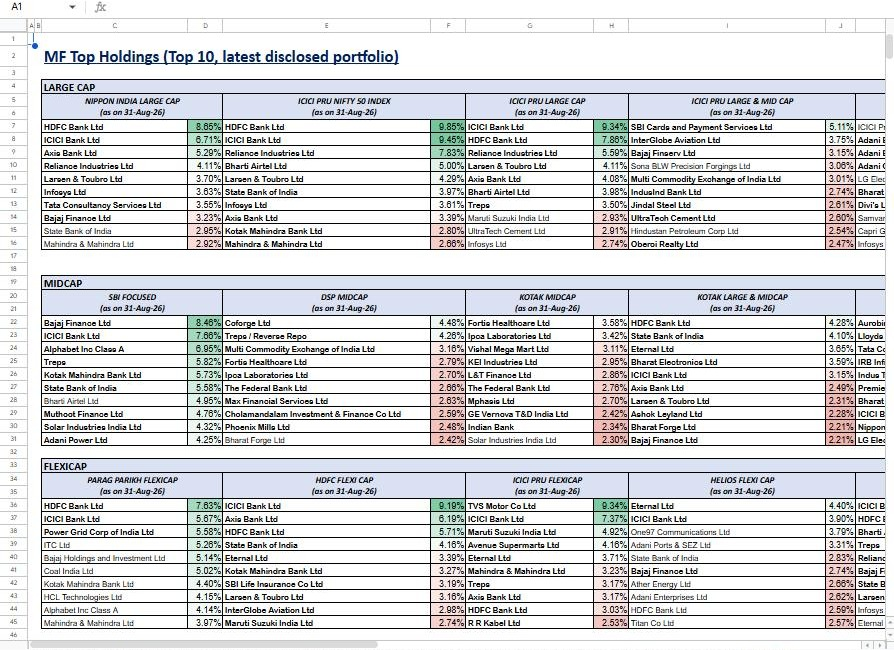
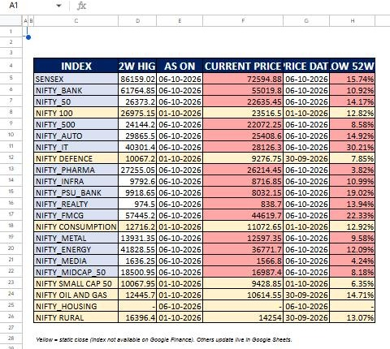
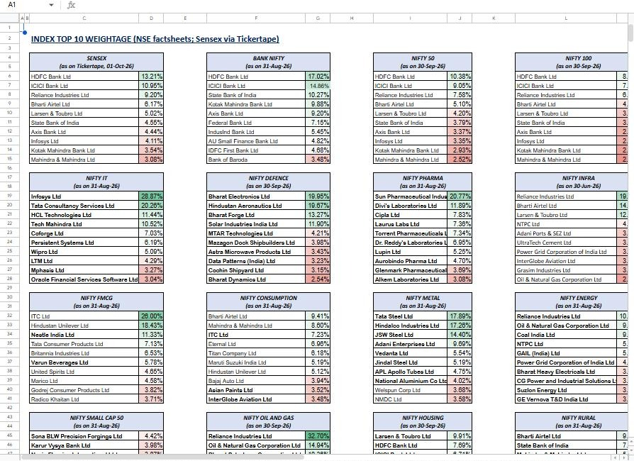
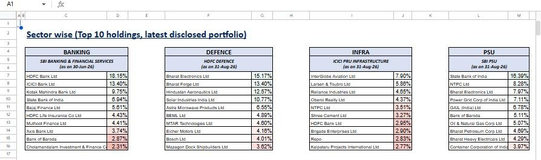

# Mutual Fund Returns Tracker — self-updating Google Sheet

[](https://github.com/SaurHub007/mutual-fund-returns-tracker/actions/workflows/tests.yml)


A Google Sheets dashboard that tracks **44 Indian mutual funds across 8 categories** and **22 NSE/BSE indices**.
A Google Apps Script job pulls official NAV data every morning, calculates 1M–5Y returns, and writes them back
into the sheet, so nobody has to copy NAVs from websites by hand.



---

## Why I built it

Comparing mutual funds usually means opening a fund house website or an aggregator for each scheme, writing down
NAVs and calculating returns by hand. That gets slow and error-prone once you follow more than a handful of funds.
I wanted **one sheet** that:

- shows every fund I follow side by side, grouped by category (Large Cap, Midcap, Flexicap, Smallcap, Thematic,
  Balanced Advantage, Debt, Multi Asset),
- **refreshes itself daily** from official sources (AMFI),
- shows what each fund actually holds and how the major indices are weighted, so returns can be read in context.

## What's inside the sheet

| Tab | What it shows | How it's updated |
|---|---|---|
| **MF Returns** | 44 funds: AUM (₹ Cr), fund managers, latest NAV, **1M / 3M / 6M / 1Y / 2Y / 3Y / 5Y and since-inception returns**, launch date, expense ratio, exit load, and a per-row script status | NAV and returns: **automated daily** (Apps Script). AUM, TER, managers, exit load: monthly, from factsheets |
| **MF Top Holdings** | Top 10 holdings with % weight for 23 funds (latest disclosed portfolio), colour-scaled | Monthly, from AMC portfolio disclosures |
| **Sector wise** | Top 10 holdings of sector and thematic funds: Banking, Defence, Infra, PSU, Gold, Value, Pharma, IT | Monthly |
| **Index view** | 22 indices (Sensex, Nifty 50, Bank Nifty, Nifty IT, Midcap 50, …): current level, 52-week high and **% below 52W high** | **Live**, via `GOOGLEFINANCE` formulas set by the script |
| **INDEX WEIGHTAGE** | Top 10 constituents and weights for 22 indices | Monthly, from NSE factsheets (Sensex via Tickertape) |

## How it works



1. **Custom menu**: `onOpen()` adds an **MF Tools** menu (*Update NAV & returns now*, *Set live formulas in Index view*, *Turn daily auto-update on/off*).

   
2. **Read ISINs** from column B of *MF Returns* and validate them against the ISIN pattern (`INF` + 9 characters).
3. **Download AMFI's daily NAV file** (`NAVAll.txt`, every scheme in India). The parser finds the header row,
   matches columns by name instead of position, and builds a lookup of **ISIN → {scheme code, NAV, date}**. There is a
   fallback URL, and a sanity check rejects the file if it maps fewer than 1,000 ISINs.
4. **Fetch NAV history** for each scheme from mfapi.in using `UrlFetchApp.fetchAll` in **parallel batches of 10**.
   This stays inside Apps Script quotas and is much faster than one request per fund.
5. **Calculate returns** for each period (see the methodology below) and write NAV, returns, since-inception return
   and a status message back to the sheet.
6. **Stamp the header** with the run time, the number of funds updated and the data source
   (e.g. *Auto-updated 06-Oct-2026 08:30 | 44 funds | Source: AMFI + mfapi.in*).

## Return methodology

- **Point-to-point absolute return**: `NAV_today / NAV_(today − N months) − 1` for N = 1, 3, 6, 12, 24, 36, 60.
- **Holidays and weekends**: binary search on the sorted NAV history to find the **last NAV on or before** the target
  date.
- **Data-quality guard**: if the nearest NAV is more than **10 days** before the target date, the fund is too young or
  the data has a gap. The cell shows `-` instead of a misleading number.
- **Month-end handling**: "1 month before 31-Mar" becomes 28/29-Feb, not 3-Mar.
- **Freshest NAV wins**: if the history feed is newer than the AMFI file, its NAV and date are used.
- **Since inception** is only calculated when the history starts within 45 days of the fund's launch date. Otherwise
  the old value is left as it is rather than overwritten with a wrong one.
- **Status column**: rows that fail say why (`ISIN not in AMFI list`, `NAV history unavailable today`), so problems
  are visible in the sheet instead of failing silently.

## Screenshots

| Full MF Returns view | MF Top Holdings |
|---|---|
|  |  |
| **Index view (live, % below 52W high)** | **Index weightage** |
|  |  |



## Run it yourself

1. Create a Google Sheet with a tab named **`MF Returns`**. Put fund ISINs in column B, starting at row 7.
   Column numbers are set in `CFG` at the top of the script.
2. Open **Extensions → Apps Script** and paste [`src/Code.gs`](src/Code.gs) (optionally replace the manifest with
   [`src/appsscript.json`](src/appsscript.json)).
3. Reload the sheet. Use **MF Tools → Update NAV & returns now**, then **MF Tools → Turn on daily auto-update (8 AM)**.
4. Optional: add a tab named **`Index view`** with Google Finance tickers in column C (rows 5–26), then click
   **MF Tools → Set live formulas in Index view**.

## Tests

All calculation logic (AMFI parsing, history parsing, date maths, return calculation) is written as **pure functions**
with no Google services, so it can be unit-tested in Node. GitHub Actions runs the tests on every push.

```bash
npm test        # Node 18+, no dependencies
```

## Repository structure

```
├── src/
│   ├── Code.gs            # Apps Script: menu, trigger, AMFI/mfapi fetch, return engine
│   └── appsscript.json    # Apps Script manifest (V8, Asia/Kolkata)
├── tests/
│   └── returns.test.js    # node:test unit tests for the pure helpers
├── docs/screenshots/      # screenshots of the live sheet
└── .github/workflows/     # CI: runs the tests on every push
```

## Limitations and next steps

- AUM, expense ratio, fund managers, holdings and index weights change monthly and have no free, reliable API, so
  they are still updated by hand.
- Returns are **absolute**. Next step: add **CAGR** for periods over 1 year and **XIRR** for SIP-style cash flows.
- Compare each fund with its **benchmark index** (alpha, rolling returns) and add a Power BI / Looker Studio view.

## Skills demonstrated

`Google Apps Script (JavaScript)` · `REST/JSON & flat-file ingestion` · `data cleaning & validation` ·
`financial return calculations` · `scheduled automation` · `Google Sheets dashboard design` · `unit testing & CI`

---

**Author:** Saurabh Khamkar, Data Analyst (Capital Markets) ·
[LinkedIn](https://www.linkedin.com/in/saurabh-khamkar) · saurabhkhamkar02@gmail.com
A view-only link to the live sheet is available on request.

*Data: AMFI (amfiindia.com) and mfapi.in, public NAV data only. This project is for analysis and learning and is
not investment advice.*
